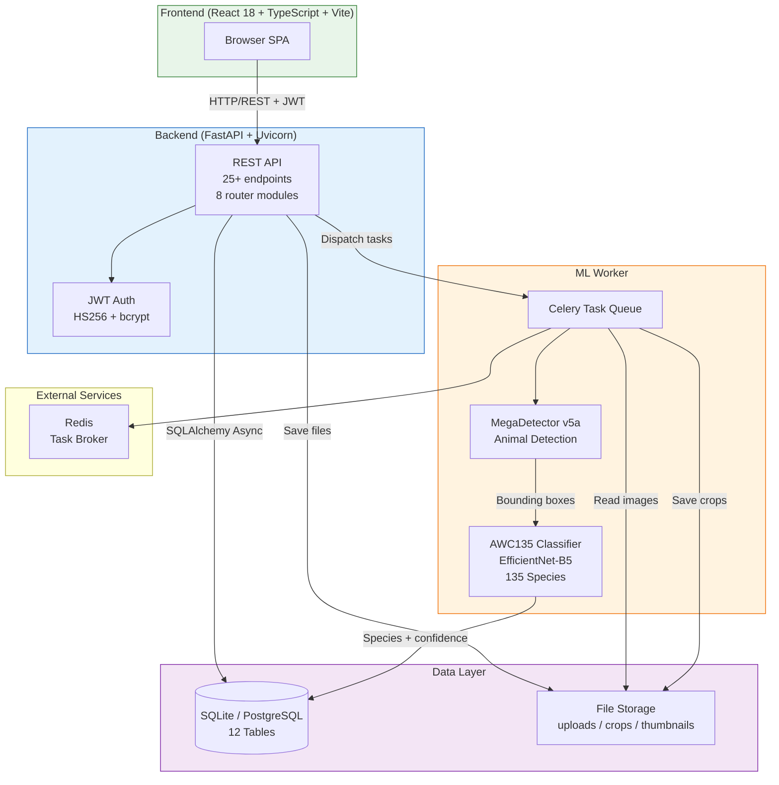
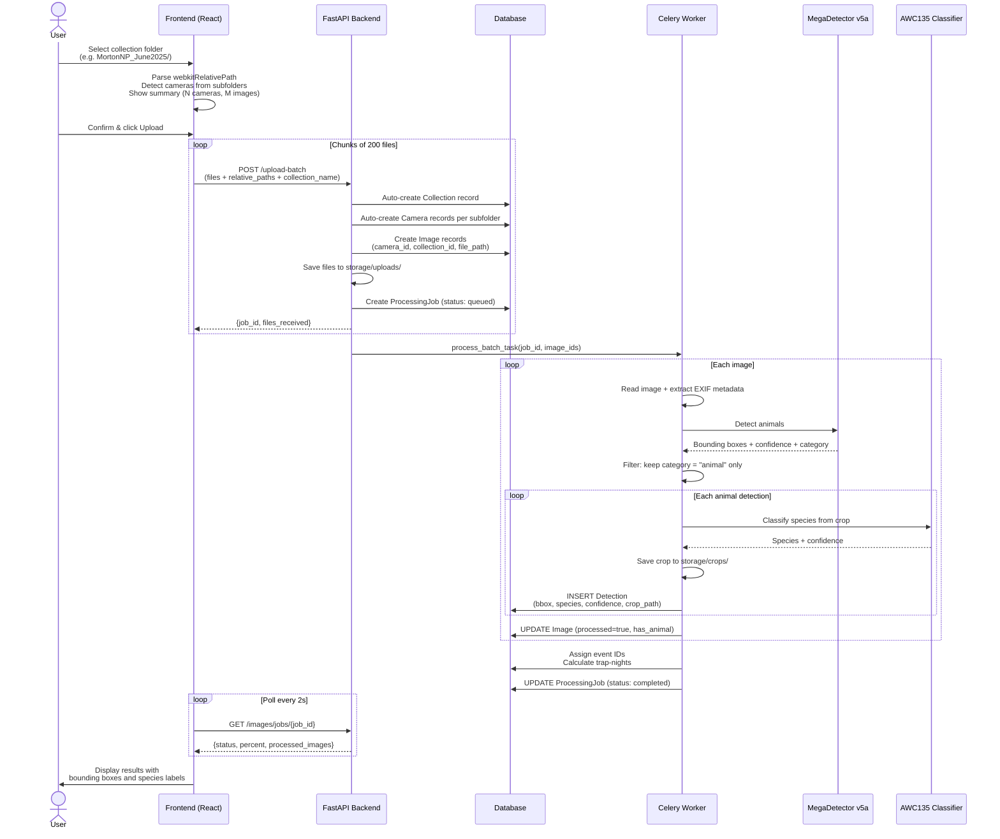
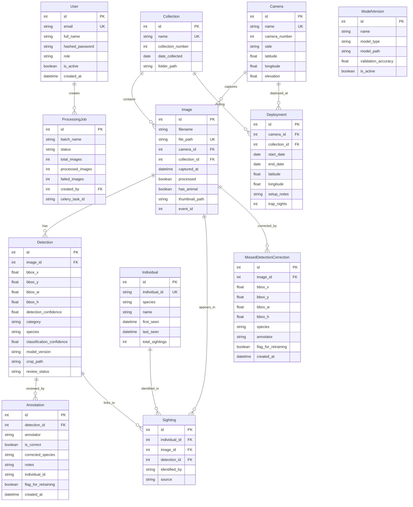
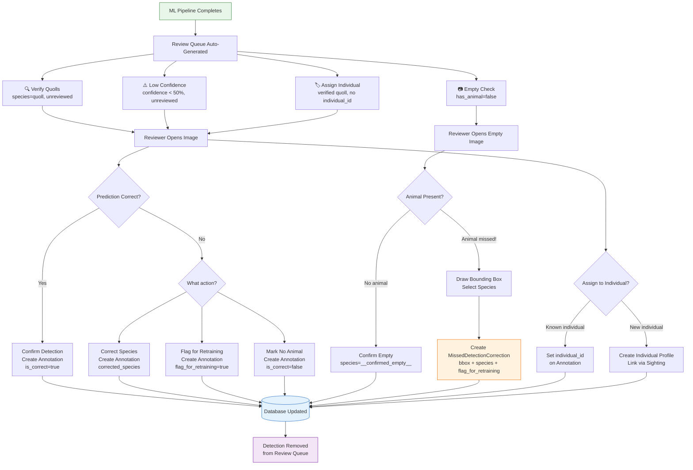

Wildlife AI Detection: Assignment 4 Report           ![][image1]

**Table of Contents**  
**1\. Introduction**  
1.1 Project Overview  

**2\. System Design and Architecture**  
2.1 AI Detection Pipeline  
2.2 Frontend: React + TypeScript  
2.3 Backend: FastAPI (Python)  
2.4 Database and Data Persistence  
2.5 Deployment Architecture  
2.6 Interface Design and Navigation  

**3\. System Functionality and User Interaction**  
3.1 Image Upload and Automated Detection Workflow  
3.2 Detection Review, Annotation, and Feedback Loop  
3.3 Implemented Features  

**4\. Requirements Traceability Matrix**  

**5\. Conclusion**  

**6\. Appendix**  
6.1 Summary of Supervisor Feedback and Actions Taken  
6.2 Screenshots  
6.3 System Architecture Diagrams  
6.4 Design Pattern Overview Table  
6.5 Project Implementation Summary  
6.6 Team Contributions  

**1\. Introduction**  
Wildlife AI Detection is a platform that uses artificial intelligence to automate the detection and monitoring of wildlife through camera trap images. This Assignment 4 (A4) report presents the minimum viable product (MVP), covering system architecture, interface design, and the requirements traceability matrix, while addressing feedback from Assignments 2 and 3. The system was developed using an Agile, user-centered methodology and integrates a React/TypeScript frontend, a FastAPI backend, and a two-stage ML pipeline (MegaDetector + AWC135 classifier) with a specific focus on detecting spotted-tailed quolls.

**1.1 Project Overview**  
Since Assignment 3, the platform has undergone significant improvements to both frontend and backend. The user interface was redesigned around a light-themed, top-navigation layout with a homepage dashboard featuring summary statistics, an interactive camera map, species distribution charts, and recent activity. A structured review workflow now categorises pending detections into four queues (verify quolls, low confidence, empty check, assign individual), and a human-in-the-loop feedback mechanism allows researchers to draw bounding boxes around missed animals, flagging corrections for future model retraining.

On the backend, a relational database (SQLite for development, with a PostgreSQL-ready configuration for production) stores images, detections, annotations, and individual animal profiles across 12 normalised tables. Asynchronous task processing via Celery (with a local asyncio fallback) enables thousands of camera trap images to be processed without blocking the API. The upload workflow was redesigned so that users select a single collection folder; the system auto-detects camera subfolders and creates the corresponding Collection and Camera records automatically.

JWT-based authentication with role-based access control (admin, researcher, reviewer) protects all write operations, and an admin panel provides user management, model version tracking, and retraining dataset export.

## **2\. System Design and Architecture**

The platform follows a modular architecture with three independently operating layers: a React frontend, a FastAPI backend, and a Celery-based ML worker. Image files are stored on the filesystem under a configurable storage root, while all metadata lives in a relational database. This separation ensures efficient handling of large-scale camera trap datasets while maintaining system responsiveness.

`[DIAGRAM 1: System Architecture Overview — see Appendix 6.3]`

### **2.1 AI Detection Pipeline**

The automated detection pipeline processes camera trap images through four stages:

* **Detection (MegaDetector v5a)** — Identifies animals and generates normalised bounding boxes. Empty images are filtered early, reducing unnecessary computation.
* **Cropping** — Extracts regions of interest from detected bounding boxes using PIL.
* **Classification (AWC135)** — A 135-species classifier (backbone: EfficientNet-B5) predicts species with confidence scores, focusing on spotted-tailed quolls.
* **Storage** — Detection records (species, confidence, bounding box, crop path, model version) are persisted to the database and images are marked as processed.

The pipeline runs asynchronously via Celery task workers. When Celery/Redis is unavailable, an in-process asyncio fallback ensures the system still functions during development. After batch processing completes, the system automatically groups images into temporal events and calculates deployment trap-night statistics.

`[DIAGRAM 2: Upload and Processing Pipeline Sequence — see Appendix 6.3]`

### **2.2 Frontend: React + TypeScript**

The frontend is a single-page application built with React 18, TypeScript, and Vite, using React Router for navigation, Leaflet for interactive maps, and Recharts for data visualisation. It provides 15+ page components including: a homepage dashboard (stats, map, charts), batch upload with folder-based camera auto-detection, an image browser, detection viewer, categorised review dashboard, species explorer with individual profiles, reports/exports, and an admin panel. Authentication is handled via JWT with role-based access.

### **2.3 Backend: FastAPI (Python)**

The backend exposes a REST API with 25+ endpoints across eight router modules (auth, images, detections, annotations, stats, reports, exports, admin). FastAPI was chosen for native async support and Python ML library integration. Key responsibilities include: JWT authentication with role-based protection, batch upload with automatic Collection/Camera creation from folder structure, Celery task dispatch for ML processing (with local asyncio fallback), annotation and missed-detection correction management, and analytics/export endpoints.

### **2.4 Database and Data Persistence**

The system uses SQLAlchemy as its ORM with an async SQLite database for development (PostgreSQL-ready for production via a single configuration change). The schema contains 12 normalised tables:

| Entity | Purpose |
| :---- | :---- |
| Users | Authentication, roles, activity tracking |
| Images | File metadata, camera/collection links, processing status, EXIF data |
| Detections | Species predictions, bounding boxes, confidence scores, crop paths |
| Annotations | User-verified corrections to model predictions |
| Cameras | Camera trap names, GPS coordinates, elevation |
| Collections | Survey/deployment periods (name, date, folder path) |
| Individuals | Known individual animals (species, first/last seen, sighting count) |
| Sightings | Links individuals to specific images and detections |
| Processing Jobs | Batch job status, progress tracking, error messages |
| Deployments | Camera deployment periods with location and setup metadata |
| Model Versions | ML model registry (path, accuracy, active status, training samples) |
| Missed Detection Corrections | User-drawn bounding boxes for animals the model missed, flagged for retraining |

`[DIAGRAM 3: Entity Relationship Diagram — see Appendix 6.3]`

Indexes are applied to frequently queried fields (species, camera+time, processing status) for efficient retrieval across large datasets.

### **2.5 Deployment Architecture**

The platform is architected for containerised deployment. The system separates into four deployable components: frontend (React/Vite), backend API (FastAPI/Uvicorn), ML worker (Celery + PyTorch/GPU), and database. In the current development environment, all components run locally. The architecture is designed to be containerised with Docker and scaled using orchestration tools such as Kubernetes for horizontal scaling of ML workers.

![][image2]

### **2.6 Interface Design and Navigation**

The interface uses a light colour theme with green ecological tones and a top-navigation header providing access to all major sections: Home, Images, Detections, Profiles, Upload, Reports, Pending Review, Help, and Admin. The design prioritises clarity and simplicity, ensuring both technical and non-technical users can navigate effectively.

`[SCREENSHOT: Homepage Dashboard — stats, map, charts, recent activity]`

Key design decisions:

* **Modular page layout** — Each page focuses on a single task (upload, browse, review, report), reducing cognitive load.
* **Real-time feedback** — Loading indicators during ML processing, progress bars during upload, and live job status polling.
* **Hierarchical species browsing** — Species Explorer → Species Detail → Individual Profiles, supporting ecological research workflows.
* **Inline review controls** — Reviewers can confirm, correct, or flag detections directly within image cards without navigating away.

# **3\. System Functionality and User Interaction**

The platform supports two primary interaction workflows — automated upload/processing and human-in-the-loop review — accessible to both technical and non-technical users through the web interface.

### **3.1 Image Upload and Automated Detection Workflow**

`[SCREENSHOT: Batch Upload — folder summary showing detected cameras]`

1. The user selects a collection folder (e.g. `MortonNP_June2025/`) containing camera trap subfolders.
2. The frontend parses `webkitRelativePath` values to detect the folder structure and displays a summary: collection name, number of cameras detected, and image count per camera. The user can edit the collection name before uploading.
3. Files are uploaded in chunks of 200 to the backend via `POST /api/images/upload-batch`, with relative paths sent as metadata.
4. The backend auto-creates Collection and Camera records from the subfolder structure, assigns each image to its camera and collection, and creates a ProcessingJob.
5. The ML pipeline (MegaDetector → crop → AWC135) processes images asynchronously, with real-time progress polling on the frontend.
6. Detection results (species, confidence, bounding boxes) are stored and the frontend updates automatically.

`[SCREENSHOT: Batch Upload — processing progress bar]`

### **3.2 Detection Review, Annotation, and Feedback Loop**

`[SCREENSHOT: Pending Review Dashboard — four category cards]`

After processing, detections are automatically sorted into four review queues:

* **Verify Quolls** — Quoll detections awaiting human confirmation.
* **Low Confidence** — Detections below 50% confidence requiring manual verification.
* **Empty Check** — Images marked as empty by the model, for users to confirm or report missed animals.
* **Assign Individual** — Verified quoll detections not yet linked to a known individual.

`[DIAGRAM 4: Review Workflow Flowchart — see Appendix 6.3]`

Reviewers can confirm predictions, correct species, assign individual IDs, or flag detections for model retraining. For images incorrectly marked as empty, users can draw a bounding box around the missed animal and submit a `MissedDetectionCorrection` record — this positive feedback loop provides training data for future model improvement.

`[SCREENSHOT: Bounding Box Drawer — user annotating a missed animal]`

### **3.3 Implemented Features**

The MVP implements all base requirements plus several features originally scoped as future work. The full mapping is shown in the RTM (Section 4). Beyond the core detection and review pipeline, implemented features include: individual animal tracking with species profiles, an interactive analytics dashboard, RAI reports and data export, and an admin panel with model version management. Remaining future scope is limited to embedding-based automatic re-identification and Docker containerisation for production.

# **4\. Requirements Traceability Matrix**

The RTM maps each system requirement to its implementation components, ensuring alignment with A2 specifications and A3 feedback.

**Status legend (MVP demo-ready, strict):** *Implemented (verified)* = backed by automated tests and/or clearly wired end-to-end; *Partially implemented* = code exists but is not fully verified end-to-end in the current repo stage (often depends on local model weights / manual setup); *Planned* = not present.

| ID | Requirement | Type | Priority | Status | Implementation (evidence) |
| :---- | :---- | :---- | :---- | :---- | :---- |
| R1 | Upload camera trap images | Functional | Base | **Implemented (verified)** | API: `POST /api/images/upload` and `POST /api/images/upload-batch` (`backend/app/api/images.py`); tests cover single-upload (`backend/tests/test_images.py`). UI route `/upload` exists (`frontend/src/App.tsx`); UI flow has Playwright coverage with mock API (`frontend/tests/e2e/frontend-capabilities.spec.ts`). |
| R2 | Automated animal detection | Functional | Base | **Partially implemented** | Worker task pipeline exists (`backend/worker/tasks.py`, `backend/worker/pipelines/megadetector_pipeline.py`), and can be run locally (`scripts/run_pipeline.py`), but end-to-end ML execution depends on local model weights and is not verified by automated tests in this repo. |
| R3 | Species classification | Functional | Base | **Partially implemented** | AWC135 wrapper exists (`backend/worker/pipelines/awc135_pipeline.py`) and is invoked from worker tasks (`backend/worker/tasks.py`) / pipeline script (`scripts/run_pipeline.py`), but requires local weights and has no automated end-to-end verification in current tests. |
| R4 | Detection visualisation | Functional | Base | **Partially implemented** | UI routes `/detections` and detection detail routes exist (`frontend/src/App.tsx`); backend provides detection list/detail (`backend/app/api/detections.py`) and image detail (`backend/app/api/images.py`). UI rendering is covered via Playwright with mock API (`frontend/tests/e2e/frontend-capabilities.spec.ts`), but not verified against the live backend in automated tests. |
| R5 | Review and annotation | Functional | Base | **Implemented (verified)** | Annotations API CRUD is tested (`backend/tests/test_annotations.py`, `backend/app/api/annotations.py`). Review queue counts exist (`GET /api/detections/review-queue` in `backend/app/api/detections.py`). UI route `/pending-review` exists (`frontend/src/App.tsx`). |
| R6 | User authentication | Functional | Base | **Implemented (verified)** | Auth endpoints (`backend/app/api/auth.py`) with JWT/roles; automated tests (`backend/tests/test_auth.py`). Frontend auth wiring present (`frontend/src/App.tsx`, `frontend/src/auth`). |
| R7 | Auto-detect cameras from folder structure | Functional | Base | **Partially implemented** | Batch upload extracts collection/camera from `webkitRelativePath` and auto-creates Camera/Collection/Deployment (`backend/app/api/images.py`, helper functions `_extract_*`, `_get_or_create_*`). Not directly covered by automated tests in current suite. |
| R8 | Individual animal tracking | Functional | Nice-to-have | **Partially implemented** | Data model exists (`backend/app/models/individual.py`, `backend/app/models/sighting.py`); dashboard exposes individuals list (`GET /api/stats/individuals` in `backend/app/api/stats.py`). UI routes under `/individuals` exist (`frontend/src/App.tsx`). Full end-to-end “individual profile + sightings” workflow is not verified by automated tests. |
| R9 | Human-in-the-loop feedback | Functional | Nice-to-have | **Partially implemented** | Missed detection feedback endpoint exists (`POST /api/images/{image_id}/missed-detection` in `backend/app/api/images.py`). Retraining flags and annotation flows are tested (`backend/tests/test_annotations.py`), but missed-detection creation is not covered by automated tests in current suite. |
| R10 | Dashboard with analytics | Functional | Nice-to-have | **Partially implemented** | Backend stats endpoints exist (`backend/app/api/stats.py`, `backend/app/api/reports.py` for summary). UI dashboard route `/` exists (`frontend/src/App.tsx`) and is covered by Playwright with mock API (`frontend/tests/e2e/frontend-capabilities.spec.ts`), but not verified against the live backend in automated tests. |
| R11 | Reports and data export | Functional | Nice-to-have | **Implemented (verified)** | Summary report + export endpoints exist and are tested (`backend/app/api/reports.py`, `backend/tests/test_reports.py`). Additional dataset exports exist (`backend/app/api/exports.py`). |
| R12 | Admin panel | Functional | Nice-to-have | **Implemented (verified)** | Admin endpoints exist and are tested (`backend/app/api/admin.py`, `backend/tests/test_admin.py`). UI route `/admin` exists (`frontend/src/App.tsx`) and is covered via Playwright with mock API (`frontend/tests/e2e/frontend-capabilities.spec.ts`). |
| NF1 | Scalable async processing | Non-functional | Base | **Partially implemented** | Async job model exists (ProcessingJob + Celery dispatch with local fallback: `backend/app/api/images.py`, `backend/worker/tasks.py`). However, horizontal scalability and multi-worker GPU throughput are not verified in automated tests and depend on deployment configuration. |
| NF2 | Responsive UI | Non-functional | Base | **Partially implemented** | React SPA routes exist (`frontend/src/App.tsx`) and core pages render in Playwright tests (`frontend/tests/e2e/frontend-capabilities.spec.ts`), but “mobile-responsive” behavior is not verified by automated tests in this repo. |
| NF3 | Efficient empty-image filtering | Non-functional | Base | **Partially implemented** | Filtering logic is implemented in the MegaDetector stage (`backend/worker/pipelines/megadetector_pipeline.py`) and consumed by pipeline runners (`backend/worker/tasks.py`, `scripts/run_pipeline.py`), but performance/accuracy is not verified in automated tests (no GPU/model-weight tests). |

# **5\. Conclusion**

The Wildlife AI Detection MVP delivers a working wildlife monitoring platform with core end-to-end workflows for upload, processing orchestration, review, and reporting. The system integrates automated detection (MegaDetector) and species classification (AWC135) with a structured human-in-the-loop review workflow, enabling researchers to process large camera-trap datasets while maintaining data quality through manual verification and correction.

Key achievements beyond the original base requirements include: folder-based upload with automatic camera detection, categorised review queues, a positive feedback loop for model retraining, individual animal tracking with species profiles, interactive dashboard analytics, and a role-based admin panel. The RTM (Section 4) confirms which requirements are **implemented and verified** at this stage, and which are **partially implemented** (notably ML execution/performance items that depend on local model weights and are not covered by automated end-to-end tests in this repo).

Remaining work focuses on converting partially implemented areas into fully verified production-ready capabilities, especially ML runtime verification/performance at scale (with local model weights), embedding-based automatic re-identification of individual animals, and Docker-based deployment hardening. Even at the current stage, the MVP demonstrates that AI-assisted workflows can significantly improve the efficiency of wildlife monitoring for ecological research.

# **6\. Appendix**

## **6.1 Summary of Supervisor Feedback and Actions Taken**

**A3 Feedback:** No major issues were identified. Minor refinements were made to improve architecture descriptions, report structure, and ML pipeline documentation.

**A2 Feedback:** Strong alignment with project requirements. Improvements were made to system objectives clarity, requirements-to-implementation traceability, and architecture modularity.

**Continuous Improvement:** The system was iteratively refined throughout development based on user testing and client feedback, including redesigning the upload workflow, adding the review dashboard, and implementing the feedback loop for model retraining.

## **6.2 Screenshots**

`[SCREENSHOT: Homepage Dashboard]`
`[SCREENSHOT: Batch Upload — folder summary with auto-detected cameras]`
`[SCREENSHOT: Batch Upload — processing progress]`
`[SCREENSHOT: Image Browser]`
`[SCREENSHOT: Detection Viewer with bounding boxes]`
`[SCREENSHOT: Pending Review Dashboard — four category cards]`
`[SCREENSHOT: Detection Review — inline controls]`
`[SCREENSHOT: Bounding Box Drawer — missed animal annotation]`
`[SCREENSHOT: Species Explorer]`
`[SCREENSHOT: Individual Profiles]`
`[SCREENSHOT: Admin Panel]`
`[SCREENSHOT: Login Page]`

## **6.3 System Architecture Diagrams**

### Diagram 1 — System Architecture Overview

### Diagram 2 — Upload and Processing Pipeline

### Diagram 3 — Entity Relationship Diagram

### Diagram 4 — Review Workflow

## **6.4 Design Pattern Overview Table**

| Pattern | Description |
| ----- | ----- |
| Modular Architecture | Separates frontend, backend, ML pipeline, and worker components |
| Asynchronous Processing | Celery workers with local asyncio fallback for non-blocking ML |
| REST API Design | 25+ endpoints across 8 router modules |
| Pipeline Processing | Sequential detection → crop → classification → storage |
| Human-in-the-Loop | Review queues, annotations, missed detection corrections |
| Repository Pattern | SQLAlchemy ORM with async session management |
| JWT Authentication | Stateless token-based auth with role-based access control |

## **6.5 Project Implementation Summary**

| Component | Technology | Description |
| ----- | ----- | ----- |
| Frontend | React 18, TypeScript, Vite, Leaflet, Recharts | SPA with dashboard, upload, review, profiles, reports, admin |
| Backend | FastAPI, SQLAlchemy, Celery, python-jose | REST API with async processing, JWT auth, 25+ endpoints |
| ML Pipeline | MegaDetector v5a, AWC135 (EfficientNet-B5) | Animal detection + 135-species classification |
| Database | SQLite (dev) / PostgreSQL (prod-ready) | 12 normalised tables via SQLAlchemy ORM |
| Authentication | JWT (HS256), bcrypt | Role-based access: admin, researcher, reviewer |

## **6.6 Team Contributions**

| Team Member | Contribution |
| :---- | :---- |
| Leroy Mun | Documentation,Frontend |
| Phakorn Jirayaphakorn | Documentation,Frontend |
| Saad ul hssan | Missing, not in any meeting with Eco and  |
| Yash Sojitra | Documentation,Backend,Frontend design |
| Chng Jin Cong Hubert | Documentation,Frontend |

 

	

